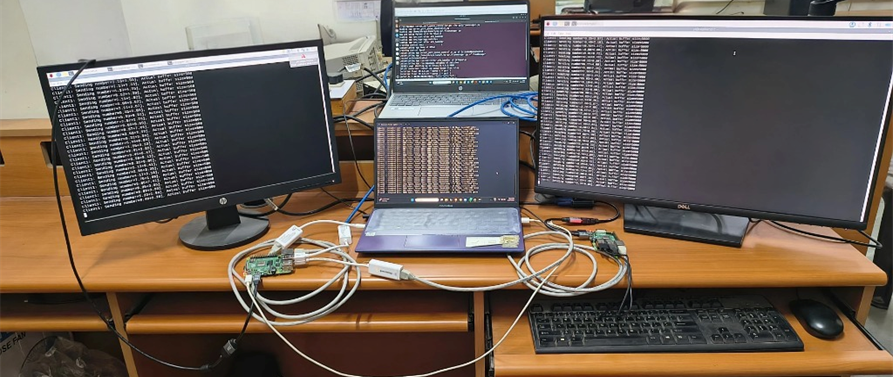

## Network Topology

Connected host 1, (internal host of OVS, **client1** with IP `10.0.0.10`, RaspberryPi 1), via internal port **h1** of the OVS.  
Host 2 (**client2** with IP `10.0.0.20`, Raspberry Pi 2), via port **eth1** to the switch, and  
Host 3 (**server** with IP `10.0.0.30`, Windows PC1), via port **eth0**.

**Roles:**
- `10.0.0.30` → Server  
- `10.0.0.20` → Client2  
- `10.0.0.10` → Client1  

---

### Created Topology Diagram

*Figure 1: shows actual setup, with two RaspberryPi, as hosts, and a server PC. In the left, RaspberryPi 1’s internal host is 
connected and, in the right, RaspberryPi 2 is connected.*

