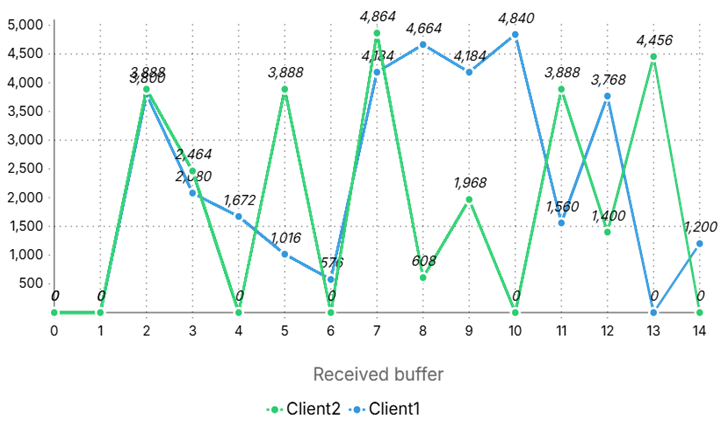

# Performance Evaluation: 

The system was evaluated using socket programming to simulate IQ signal traffic (TCP port `12345`) from client2 and competing background traffic. The server log was used to analyze performance.

---

## Key Observations

### **1. Server Log Analysis**
- **Figure 1**: Server log showing results **without** implementing QoS
  

- **Figure 2**: Server log showing results **with** QoS implementation  
  
---

### **2. Bandwidth Utilization**
- **Client2** (IQ signals) achieved **91.5%** of the total bandwidth with QoS, compared to around **65.6%** without prioritization.  
- Ensures high throughput for Client2.  

**Graphs**:  
- **Graph 1**: Bandwidth allocation for clients (no QoS)
  
  
- **Graph 2**: Bandwidth allocation with Client2 prioritization  
  
---

### **3. Data Loss**
- **Buffer Size (Expected)**: 5000 bytes from both clients  
- **Loss Without QoS**:  
  - Client1 → 47.84%  
  - Client2 → 39.17%  
- **Loss With QoS**:  
  - Client1 → 48.98% (even after sending low buffer size)  
  - Client2 → **7%**  

**Graphs**:  
- **Graph 3**: Buffer loss (no prioritization)
  
  
- **Graph 4**: Buffer loss (with Client2 prioritization)  
  
---

### **4. Queue Statistics (Port eth0)**
- **Queue 0 (Client 1)**:  
  - Packets → 8.7 million  
  - Bytes → 14.5 billion  
- **Queue 1 (Client 2)**:  
  - Packets → 125,462  
  - Bytes → 1.6 billion  

**Graph 5**: Packets and bytes processed by each queue for two clients.  
  

---

## **Conclusion**
The QoS-aware SDN architecture using **Open vSwitch** and the **Ryu controller** on Raspberry Pi demonstrated:  
- Improved traffic management and bandwidth utilization for real-time IQ signal transmission.  
- Under baseline (no QoS), IQ signals competed unfavourably with bulk traffic, reducing throughput and increasing packet loss for both traffic types.  
- After queue-based prioritization via Ryu, the system dynamically allocated bandwidth, ensuring IQ signals from the high-priority client consistently received maximum available bandwidth—even with simultaneous competing traffic.
